# Architecture Document

## Document Info
- **Project:** [Project Name]
- **Author:** [Author]
- **Date:** [Date]
- **Status:** Draft | Review | Approved

---

## 1. Overview

### Purpose
[Brief description of what this system does]

### Scope
[What this architecture covers and doesn't cover]

### Architecture Style
[Monolith | Microservices | Serverless | Hybrid]

---

## 2. System Context

### Context Diagram

### External Systems
| System | Purpose | Integration |
|--------|---------|-------------|
| [System 1] | [Purpose] | [REST/GraphQL/etc] |
| [System 2] | [Purpose] | [REST/GraphQL/etc] |

---

## 3. System Components

### Component Diagram

### Component Descriptions

#### Frontend
| Component | Responsibility | Technology |
|-----------|---------------|------------|
| UI Layer | User interface rendering | [React/Vue/etc] |
| State Management | Application state | [Redux/Zustand/etc] |

#### Backend
| Component | Responsibility | Technology |
|-----------|---------------|------------|
| API Layer | Request handling | [Express/FastAPI/etc] |
| Service Layer | Business logic | [Node.js/Python/etc] |
| Data Layer | Data access | [Prisma/TypeORM/etc] |

---

## 4. Data Architecture

### Data Model

```mermaid
erDiagram
    User ||--o{ Order : places
    Order ||--|{ OrderItem : contains
    Product ||--o{ OrderItem : "ordered in"
    
    User {
        uuid id PK
        string email
        string name
        timestamp created_at
    }
    
    Order {
        uuid id PK
        uuid user_id FK
        decimal total
        string status
        timestamp created_at
    }
```

### Database Choice
- **Type:** [PostgreSQL | MongoDB | etc]
- **Rationale:** [Why this database]

### Data Flow
[Description of how data flows through the system]

---

## 5. API Design

### API Style
[REST | GraphQL | gRPC]

### Key Endpoints

#### Authentication
| Method | Endpoint | Description |
|--------|----------|-------------|
| POST | /auth/login | User login |
| POST | /auth/register | User registration |
| POST | /auth/logout | User logout |

#### Resources
| Method | Endpoint | Description |
|--------|----------|-------------|
| GET | /api/[resource] | List resources |
| POST | /api/[resource] | Create resource |
| GET | /api/[resource]/:id | Get resource |
| PUT | /api/[resource]/:id | Update resource |
| DELETE | /api/[resource]/:id | Delete resource |

### Authentication
- **Method:** [JWT | OAuth2 | Session]
- **Token Storage:** [Cookie | LocalStorage | Memory]

---

## 6. Technology Stack

### Frontend
| Layer | Technology | Version |
|-------|------------|---------|
| Framework | [React/Vue/etc] | [Version] |
| State | [Redux/Zustand/etc] | [Version] |
| Styling | [Tailwind/CSS Modules/etc] | [Version] |
| Build | [Vite/Webpack/etc] | [Version] |

### Backend
| Layer | Technology | Version |
|-------|------------|---------|
| Runtime | [Node.js/Python/etc] | [Version] |
| Framework | [Express/FastAPI/etc] | [Version] |
| ORM | [Prisma/TypeORM/etc] | [Version] |

### Infrastructure
| Component | Technology |
|-----------|------------|
| Database | [PostgreSQL/MongoDB/etc] |
| Cache | [Redis/Memcached/etc] |
| Hosting | [Vercel/AWS/etc] |
| CI/CD | [GitHub Actions/etc] |

---

## 7. Quality Attributes

### Performance
- **Response Time:** < [X]ms for 95th percentile
- **Throughput:** [X] requests/second
- **Strategy:** [Caching, CDN, optimization approaches]

### Scalability
- **Approach:** [Horizontal | Vertical]
- **Bottlenecks:** [Identified bottlenecks]
- **Strategy:** [How to scale]

### Security
- **Authentication:** [Method]
- **Authorization:** [RBAC | ABAC | etc]
- **Data Protection:** [Encryption, sanitization]
- **OWASP:** [Top 10 considerations]

### Reliability
- **Availability Target:** [99.9% | etc]
- **Recovery:** [Backup strategy, RTO, RPO]
- **Monitoring:** [Tools and approach]

---

## 8. Deployment Architecture

### Environment Strategy
| Environment | Purpose | URL |
|-------------|---------|-----|
| Development | Local development | localhost |
| Staging | Pre-production testing | staging.example.com |
| Production | Live system | example.com |

### Deployment Diagram

### CI/CD Pipeline
1. Code push → GitHub
2. Automated tests
3. Build
4. Deploy to staging
5. Manual approval
6. Deploy to production

---

## 9. Architecture Decisions (ADRs)

### ADR-1: [Decision Title]
- **Status:** Accepted
- **Context:** [Why this decision was needed]
- **Decision:** [What was decided]
- **Consequences:** [Impact of the decision]

### ADR-2: [Decision Title]
- **Status:** Accepted
- **Context:** [Why this decision was needed]
- **Decision:** [What was decided]
- **Consequences:** [Impact of the decision]

---

## 10. Risks and Mitigations

| Risk | Impact | Likelihood | Mitigation |
|------|--------|------------|------------|
| [Risk 1] | High | Medium | [Strategy] |
| [Risk 2] | Medium | Low | [Strategy] |

---

## Appendix

### Glossary
- **[Term]:** [Definition]

### References
- [Reference 1]
- [Reference 2]
