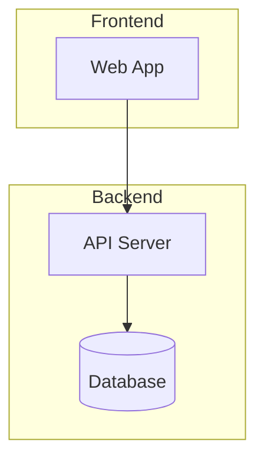
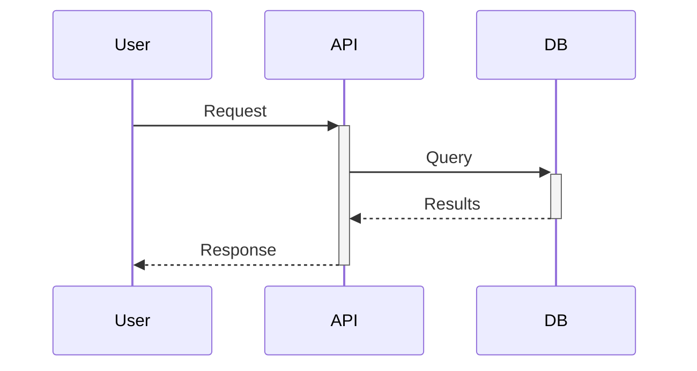
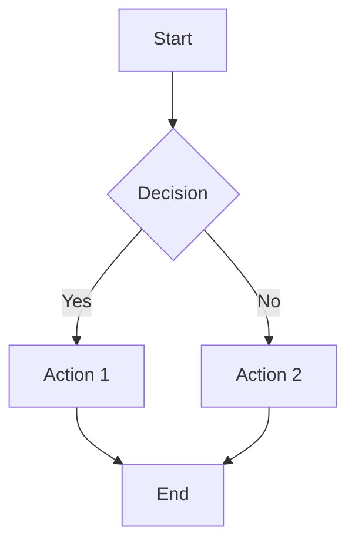

# Workflow: Create Diagram

## Purpose
Generate various types of diagrams for documentation and communication.

## Agent
Tech Writer (Paige) or Architect (Winston)

## Diagram Types
- **Flowchart** - Process flows, decision trees
- **Sequence** - API interactions, message flows
- **Architecture** - System components, infrastructure
- **Data Flow** - Data movement through system
- **ERD** - Entity relationships, database schema
- **Wireframe** - UI layouts (text-based)

---

## Process

### Step 1: Identify Diagram Need

**What are you trying to communicate?**
- System overview → Architecture diagram
- Process steps → Flowchart
- API interactions → Sequence diagram
- Data movement → Data flow diagram
- Database structure → ERD
- UI layout → Wireframe

### Step 2: Gather Context

**For Architecture Diagrams:**
- Load architecture.md
- Identify key components
- Note integration points

**For Flowcharts:**
- Identify start/end points
- Map decision points
- Note all paths

**For Sequence Diagrams:**
- List participants (services, users)
- Map message flow
- Note async vs sync calls

**For Data Flow:**
- Identify data sources
- Map transformations
- Note storage points

### Step 3: Generate Diagram

**Using Mermaid Syntax:**







### Step 4: Refine and Document

1. Add clear labels
2. Include legend if needed
3. Add to appropriate documentation
4. Note any simplifications made

---

## Quick Reference: Mermaid Syntax

### Flowchart
```
flowchart TD|LR|BT|RL
    A[Rectangle] --> B(Rounded)
    B --> C{Diamond}
    C -->|Yes| D[(Database)]
    C -->|No| E((Circle))
```

### Sequence
```
sequenceDiagram
    participant A
    participant B
    A->>B: Sync call
    A-->>B: Async call
    B->>A: Response
```

### Class/ERD
```
classDiagram
    User "1" --> "*" Order
    Order "*" --> "*" Product
```

### State
```
stateDiagram-v2
    [*] --> Draft
    Draft --> Published
    Published --> [*]
```

---

## Output

- Mermaid diagram code block
- Embedded in relevant documentation
- Optionally exported as image

---

## Tips

1. **Start simple** - Add detail iteratively
2. **Use subgraphs** - Group related components
3. **Clear labels** - Self-documenting diagrams
4. **Consistent style** - Match project conventions
5. **Include in docs** - Diagrams near relevant text
