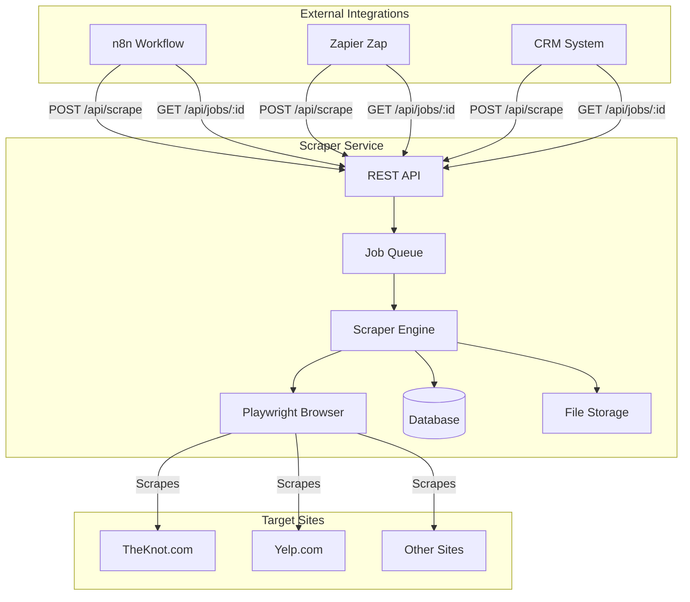
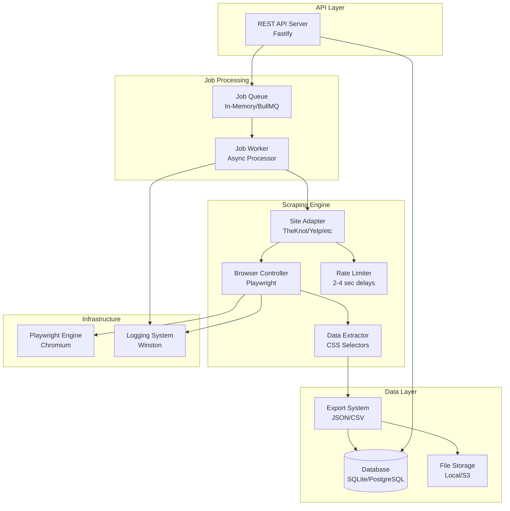
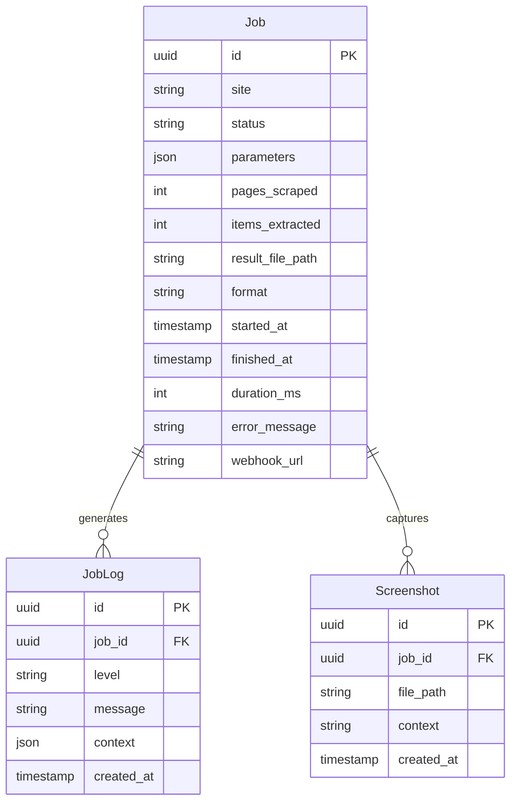
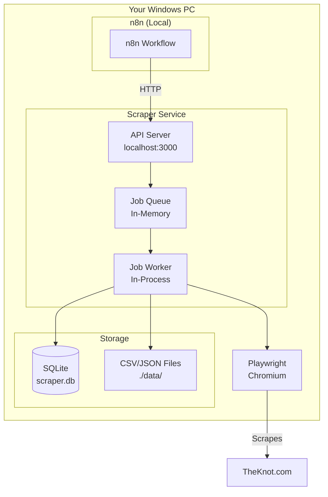
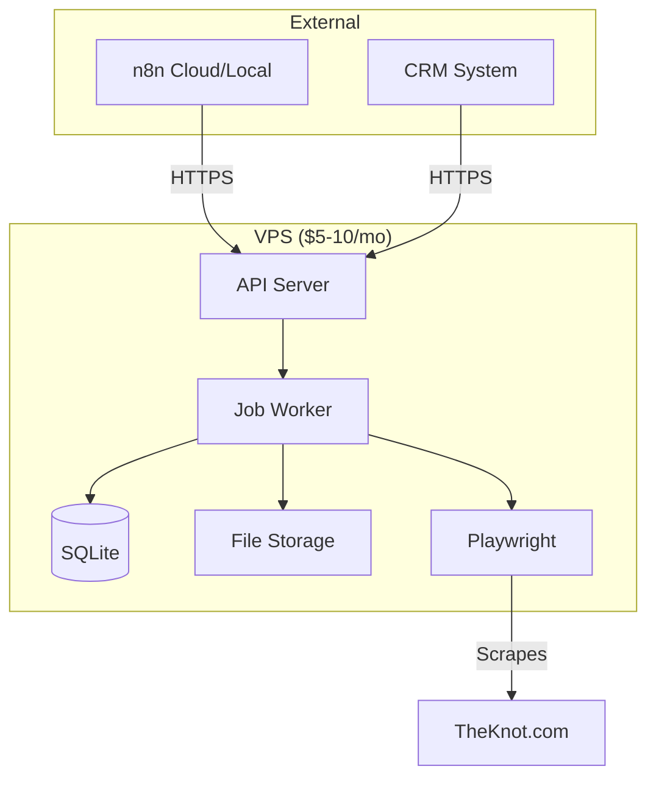

# Architecture Document
# Web Scraping Automation Platform

## Document Info
- **Project:** Web Scraping Automation Platform
- **Architect:** Winston (System Architect)
- **Date:** January 25, 2026
- **Status:** Draft v1.0
- **Based on:** PRD v1.0

---

## 1. Overview

### Zero-Cost Quick Start

**Total Cost: $0/month** - Run everything on your existing Windows PC

```bash
# 1. Install Node.js (free, one-time)
# Download from: https://nodejs.org/

# 2. Clone/create project
git clone <your-repo>
cd scraper-automation-tool

# 3. Install dependencies (free, one-time)
npm install

# 4. Start the scraper
npm run dev

# 5. API is now running at http://localhost:3000
# No VPS, no cloud, no subscriptions needed!
```

**What you get for $0:**
- ✅ REST API for scraping
- ✅ TheKnot adapter (wedding venues)
- ✅ SQLite database (built-in)
- ✅ CSV/JSON export
- ✅ Job queue (in-memory)
- ✅ Error handling with screenshots
- ✅ n8n integration (if n8n is also local)

**When you might need costs:**
- Only if you want 24/7 availability (VPS: $5-10/month)
- Only if you scale to sites that need proxies (future)

---

### Purpose
An **API-first web scraping service** designed for integration with automation platforms (n8n, Zapier) and CRM systems. Provides a simple REST API for scraping public business listings from sites like TheKnot.com, with a focus on cost-effectiveness and reliability.

### Primary Use Case
**TheKnot.com Wedding Venue Scraper**
- Target: Public business listings (wedding venues)
- Data: 6 fields (Venue Name, Location, Star Rating, Review Count, Starting Price, Profile URL)
- Protection Level: Low (no CAPTCHA, no proxies needed)
- **Cost Target: $0/month (100% savings vs BrowserAct's $500+/month)**
- Deployment: Local machine (Windows PC)

### Scope
**In Scope:**
- REST API for job submission and retrieval
- Browser automation (Playwright with Chromium)
- Site adapter pattern (TheKnot, extensible to Yelp, etc.)
- Data extraction and export (JSON/CSV matching BrowserAct format)
- Async job queue with status polling
- Basic rate limiting (2-4 second delays)
- n8n/Zapier/CRM integration patterns

**Out of Scope (v1.0):**
- Visual workflow builder
- AI-powered element detection
- CAPTCHA solving (not needed for TheKnot)
- Proxy rotation (not needed for TheKnot)
- Stealth/anti-detection (not needed for TheKnot)
- Multi-user authentication
- Real-time streaming

### Architecture Style
**API-First Modular Monolith** - REST API as primary interface with async job processing. Single deployable unit with clear internal boundaries.

**Rationale:** 
- **API-first:** Designed for n8n/Zapier/CRM integration from day one
- **Async processing:** Long-running scraping jobs don't block API requests
- **Simple deployment:** Single service, easy to run on localhost or VPS
- **Cost-effective:** No external services needed for MVP (TheKnot use case)
- **Extensible:** Site adapter pattern allows adding new sites easily
- **Scalable:** Can scale horizontally by running multiple instances

---

## 2. System Context

### Context Diagram


### External Systems
| System | Purpose | Integration | Required |
|--------|---------|-------------|----------|
| TheKnot.com | Primary data source | HTTPS (public pages) | Yes (MVP) |
| n8n | Workflow automation | REST API (HTTP Request node) | No (integration target) |
| Zapier | Workflow automation | Webhooks | No (integration target) |
| CRM Systems | Data destination | REST API / Webhooks | No (integration target) |
| Yelp/Other Sites | Future data sources | HTTPS (public pages) | No (post-MVP) |

### Integration Patterns

**n8n Integration:**
```
1. n8n HTTP Request → POST /api/scrape (submit job)
2. n8n Wait → Delay 30 seconds
3. n8n HTTP Request → GET /api/jobs/:id (check status)
4. n8n IF → status === 'completed' ? proceed : loop back to step 2
5. n8n HTTP Request → GET /api/jobs/:id/results (get data)
6. n8n Process → Transform and use data
```

**CRM Integration:**
```
1. CRM webhook → POST /api/scrape (submit job)
2. Scraper processes → Job completes
3. Scraper webhook → POST to CRM callback URL (push results)
```

---

## 3. System Components

### High-Level Architecture


### Component Descriptions

#### API Layer

**REST API Server**
- **Responsibility:** Primary interface for job submission and retrieval
- **Technology:** Fastify (high performance, TypeScript-first)
- **Key Endpoints:**
  - POST `/api/scrape` - Submit scraping job
  - GET `/api/jobs/:id` - Get job status
  - GET `/api/jobs/:id/results` - Get job results (JSON/CSV)
  - GET `/api/jobs` - List jobs (with filters)
  - GET `/api/health` - Health check
- **Authentication:** API key (Bearer token)
- **Response Pattern:** Async (submit → poll → retrieve)

**API Request/Response Examples:**
```typescript
// Submit job
POST /api/scrape
{
  "site": "theknot",
  "category": "wedding-reception-venues",
  "location": "los-angeles-ca",
  "maxPages": 5,
  "format": "csv"
}
Response: {
  "jobId": "job_abc123",
  "status": "queued",
  "estimatedDuration": "2-5 minutes"
}

// Check status
GET /api/jobs/job_abc123
Response: {
  "jobId": "job_abc123",
  "status": "running",
  "progress": {
    "currentPage": 2,
    "totalPages": 5,
    "itemsExtracted": 48
  }
}

// Get results
GET /api/jobs/job_abc123/results
Response: {
  "jobId": "job_abc123",
  "status": "completed",
  "results": {
    "format": "csv",
    "downloadUrl": "/api/jobs/job_abc123/download",
    "itemCount": 127,
    "pages": 5
  },
  "data": [ /* inline data if small */ ]
}
```

#### Job Processing

**Job Queue**
- **Responsibility:** Manage async job execution
- **Technology:** In-memory queue (MVP), BullMQ + Redis (production)
- **Features:**
  - FIFO processing
  - Job persistence
  - Retry logic
  - Concurrency control (max 3 concurrent jobs)
- **Job States:** queued → running → completed/failed

**Job Worker**
- **Responsibility:** Process jobs from queue
- **Pattern:** Worker pool (3 workers by default)
- **Lifecycle:**
  1. Poll queue for next job
  2. Load site adapter
  3. Execute scraping
  4. Save results
  5. Update job status
  6. Trigger webhook (if configured)

#### Scraping Engine

**Site Adapter (NEW - Key Pattern)**
- **Responsibility:** Site-specific scraping logic
- **Pattern:** Strategy pattern for extensibility
- **Interface:**
  ```typescript
  interface SiteAdapter {
    name: string;
    buildUrl(params: SiteParams): string;
    extractData(page: Page): Promise<SiteData[]>;
    handlePagination(page: Page): Promise<boolean>;
    getRateLimit(): number; // milliseconds between requests
  }
  ```
- **Implementations:**
  - `TheKnotAdapter` - Wedding venues (MVP)
  - `YelpAdapter` - Business listings (future)
  - `CustomAdapter` - User-defined (future)

**TheKnot Adapter Specifics:**
```typescript
class TheKnotAdapter implements SiteAdapter {
  name = 'theknot';
  
  buildUrl(params: { category: string, location: string }): string {
    return `https://www.theknot.com/marketplace/${params.category}-${params.location}`;
  }
  
  async extractData(page: Page): Promise<VenueData[]> {
    return page.$$eval('.vendor-card', cards => cards.map(card => ({
      name: card.querySelector('.vendor-name')?.textContent,
      location: card.querySelector('.vendor-location')?.textContent,
      rating: parseFloat(card.querySelector('.rating-value')?.textContent),
      reviewCount: parseInt(card.querySelector('.review-count')?.textContent),
      startingPrice: card.querySelector('.starting-price')?.textContent,
      profileUrl: card.querySelector('a.vendor-link')?.href
    })));
  }
  
  async handlePagination(page: Page): Promise<boolean> {
    const nextButton = await page.$('button[aria-label="Next"]');
    if (!nextButton || await nextButton.isDisabled()) return false;
    
    await nextButton.click();
    await page.waitForLoadState('networkidle');
    await page.waitForTimeout(2000); // Respectful delay
    return true;
  }
  
  getRateLimit(): number {
    return 2000; // 2 seconds between requests
  }
}
```

**Browser Controller**
- **Responsibility:** Manage browser automation
- **Technology:** Playwright with Chromium
- **Configuration:**
  - Headless mode (default)
  - Standard user agent (no stealth needed for TheKnot)
  - Automatic wait for elements
  - Screenshot on errors
- **Resource Management:** Browser pool (max 3 concurrent)
- **No Anti-Detection:** TheKnot doesn't require proxies or CAPTCHA

**Data Extractor**
- **Responsibility:** Extract structured data from pages
- **Methods:**
  - CSS selector extraction
  - Type coercion (string → number)
  - Null handling (missing fields)
- **Output Format:** Matches BrowserAct CSV format
  ```csv
  Venue Name,Location,Star Rating,Review Count,Starting Price,Profile URL
  "The Grand Ballroom","Los Angeles, CA",4.8,127,"$5,000",https://...
  ```

**Rate Limiter**
- **Responsibility:** Control request rate
- **Strategy:** Fixed delay between requests
- **TheKnot Settings:**
  - 2-4 second delays between pages
  - Random jitter (±500ms) to appear more human
  - No need for complex patterns (public data)

#### Data Layer

**Export System**
- **Responsibility:** Export data in multiple formats
- **Supported Formats:**
  - JSON (BrowserAct-compatible)
  - CSV (BrowserAct-compatible)
- **Pattern:** Strategy pattern for different exporters
- **Storage:** Local filesystem (MVP), S3-compatible (future)

**Database**
- **Responsibility:** Store job metadata and status
- **Technology:** SQLite (default), PostgreSQL (production)
- **Schema:** See Data Architecture section
- **Note:** Results stored in files, not database (large datasets)

**File Storage**
- **Responsibility:** Store exported files
- **Technology:** Local filesystem (default), S3-compatible (optional)
- **Structure:**
  ```
  data/
  ├── jobs/
  │   ├── job_abc123.json
  │   ├── job_abc123.csv
  │   └── job_xyz789.csv
  ├── screenshots/
  │   └── job_abc123_error.png
  └── logs/
      └── job_abc123.log
  ```

#### Infrastructure

**Playwright Engine**
- **Responsibility:** Low-level browser automation
- **Configuration:**
  - Headless Chromium (sufficient for TheKnot)
  - Standard settings (no stealth)
  - Automatic wait for elements
  - Network idle detection

**Logging System**
- **Responsibility:** Comprehensive logging for debugging
- **Technology:** Winston (Node.js logging)
- **Levels:** error, warn, info, debug
- **Outputs:** Console, file, database

---

## 4. Data Architecture

### Data Model


### Simplified Schema (API-First)
**Key Changes from Original:**
- Removed `Workflow` table (no pre-defined workflows, just ad-hoc jobs)
- Removed `JobResult` table (results stored in files, not DB)
- Added `site` field (theknot, yelp, etc.)
- Added `webhook_url` for CRM integration
- Simplified to job-centric model

### Database Choice
- **Default:** SQLite
  - **Rationale:** Zero configuration, perfect for localhost development
  - **Sufficient for:** 10K+ jobs, single-instance deployment
  
- **Production:** PostgreSQL
  - **Rationale:** Multi-instance support, better concurrency
  - **When needed:** Multiple scraper instances, high job volume

### Data Flow
```
1. API receives scrape request → Job created (status: queued)
2. Worker picks job → Job status: running
3. Browser scrapes pages → JobLog entries
4. Data extracted → Saved to file (CSV/JSON)
5. Job completes → Job status: completed, result_file_path updated
6. Webhook triggered → POST results to CRM (if configured)
7. Errors captured → Screenshots + error_message
```

### Job Status States
```
queued → running → completed
                 ↘ failed
```

### File Storage Pattern
```
data/
├── jobs/
│   ├── job_abc123_theknot_los-angeles-ca.csv
│   ├── job_abc123_theknot_los-angeles-ca.json
│   └── job_xyz789_yelp_san-francisco-ca.csv
├── screenshots/
│   ├── job_abc123_page2_error.png
│   └── job_xyz789_page5_error.png
└── logs/
    ├── job_abc123.log
    └── job_xyz789.log
```

---

## 5. API Design

### API Style
**REST** - Simple, well-understood, perfect for n8n/Zapier integration

### Authentication
- **Method:** API Key (Bearer token)
- **Storage:** Environment variable (`SCRAPER_API_KEY`)
- **Header:** `Authorization: Bearer <api_key>`
- **Scope:** Single-user/team deployment (no multi-tenancy in v1.0)

### Core Endpoints

#### Submit Scraping Job
```typescript
POST /api/scrape
Authorization: Bearer <api_key>
Content-Type: application/json

Body: {
  "site": "theknot",                    // Required: theknot, yelp, etc.
  "category": "wedding-reception-venues", // Site-specific
  "location": "los-angeles-ca",          // Site-specific
  "maxPages": 5,                         // Optional, default: 10
  "format": "csv",                       // Optional: csv, json, default: csv
  "webhookUrl": "https://..."            // Optional: callback URL
}

Response 202 Accepted: {
  "jobId": "job_abc123",
  "status": "queued",
  "estimatedDuration": "2-5 minutes",
  "statusUrl": "/api/jobs/job_abc123"
}

Response 400 Bad Request: {
  "error": {
    "code": "INVALID_SITE",
    "message": "Site 'invalid' not supported. Available: theknot, yelp"
  }
}
```

#### Get Job Status
```typescript
GET /api/jobs/:jobId
Authorization: Bearer <api_key>

Response 200 OK (queued): {
  "jobId": "job_abc123",
  "status": "queued",
  "site": "theknot",
  "parameters": {
    "category": "wedding-reception-venues",
    "location": "los-angeles-ca"
  },
  "createdAt": "2026-01-25T10:00:00Z"
}

Response 200 OK (running): {
  "jobId": "job_abc123",
  "status": "running",
  "site": "theknot",
  "progress": {
    "currentPage": 2,
    "totalPages": 5,
    "itemsExtracted": 48,
    "percentComplete": 40
  },
  "startedAt": "2026-01-25T10:01:00Z"
}

Response 200 OK (completed): {
  "jobId": "job_abc123",
  "status": "completed",
  "site": "theknot",
  "results": {
    "itemCount": 127,
    "pagesScraped": 5,
    "format": "csv",
    "downloadUrl": "/api/jobs/job_abc123/download"
  },
  "startedAt": "2026-01-25T10:01:00Z",
  "finishedAt": "2026-01-25T10:04:32Z",
  "duration": 212000
}

Response 200 OK (failed): {
  "jobId": "job_abc123",
  "status": "failed",
  "error": {
    "message": "Failed to load page after 3 retries",
    "code": "PAGE_LOAD_FAILED",
    "screenshotUrl": "/api/jobs/job_abc123/screenshot"
  },
  "startedAt": "2026-01-25T10:01:00Z",
  "finishedAt": "2026-01-25T10:03:15Z"
}

Response 404 Not Found: {
  "error": {
    "code": "JOB_NOT_FOUND",
    "message": "Job 'job_abc123' not found"
  }
}
```

#### Download Job Results
```typescript
GET /api/jobs/:jobId/download
Authorization: Bearer <api_key>

Response 200 OK:
Content-Type: text/csv (or application/json)
Content-Disposition: attachment; filename="theknot_los-angeles-ca_2026-01-25.csv"

Venue Name,Location,Star Rating,Review Count,Starting Price,Profile URL
"The Grand Ballroom","Los Angeles, CA",4.8,127,"$5,000",https://...
...

Response 404 Not Found: {
  "error": {
    "code": "RESULTS_NOT_FOUND",
    "message": "Results not available. Job may still be running or failed."
  }
}
```

#### Get Job Results (Inline JSON)
```typescript
GET /api/jobs/:jobId/results
Authorization: Bearer <api_key>

Response 200 OK: {
  "jobId": "job_abc123",
  "status": "completed",
  "format": "csv",
  "itemCount": 127,
  "data": [
    {
      "venueName": "The Grand Ballroom",
      "location": "Los Angeles, CA",
      "starRating": 4.8,
      "reviewCount": 127,
      "startingPrice": "$5,000",
      "profileUrl": "https://..."
    },
    // ... more items (limited to 100 inline, use /download for full dataset)
  ],
  "downloadUrl": "/api/jobs/job_abc123/download"
}
```

#### List Jobs
```typescript
GET /api/jobs?site=theknot&status=completed&limit=20&offset=0
Authorization: Bearer <api_key>

Response 200 OK: {
  "jobs": [
    {
      "jobId": "job_abc123",
      "status": "completed",
      "site": "theknot",
      "itemCount": 127,
      "createdAt": "2026-01-25T10:00:00Z",
      "finishedAt": "2026-01-25T10:04:32Z"
    },
    // ... more jobs
  ],
  "total": 45,
  "limit": 20,
  "offset": 0
}
```

#### Health Check
```typescript
GET /api/health

Response 200 OK: {
  "status": "ok",
  "version": "1.0.0",
  "uptime": 86400,
  "jobs": {
    "queued": 2,
    "running": 1,
    "completed": 127
  }
}
```

### Webhook Pattern (CRM Integration)
When a job completes, if `webhookUrl` was provided:
```typescript
POST <webhookUrl>
Content-Type: application/json

Body: {
  "jobId": "job_abc123",
  "status": "completed",
  "site": "theknot",
  "results": {
    "itemCount": 127,
    "downloadUrl": "https://scraper.example.com/api/jobs/job_abc123/download"
  },
  "data": [ /* inline data */ ]
}
```

### Error Handling
```typescript
// Standard error response
{
  "error": {
    "code": string,        // e.g., 'INVALID_SITE', 'JOB_NOT_FOUND'
    "message": string,     // Human-readable message
    "details"?: any        // Additional context
  }
}

// HTTP Status Codes
200 - Success
202 - Accepted (job queued)
400 - Bad Request (invalid parameters)
401 - Unauthorized (invalid API key)
404 - Not Found (job/resource not found)
429 - Too Many Requests (rate limit exceeded)
500 - Internal Server Error
```

### Rate Limiting
- **Per API Key:** 100 requests/hour
- **Concurrent Jobs:** 3 per API key
- **Response Header:** `X-RateLimit-Remaining: 95`

---

## 6. Technology Stack

### Core Stack
| Layer | Technology | Version | Rationale |
|-------|------------|---------|-----------|
| Language | TypeScript | 5.x | Type safety, excellent tooling, Playwright support |
| Runtime | Node.js | 20 LTS | Stable, mature, great ecosystem |
| Browser | Playwright | 1.40+ | Modern, reliable, Chromium support |
| Database | SQLite → PostgreSQL | Latest | Simple start, easy migration |
| API Framework | Fastify | 4.x | Fast, TypeScript-first, excellent DX |
| Job Queue | In-Memory → BullMQ | Latest | Simple start, Redis-backed for production |
| Logging | Winston | 3.x | Flexible, production-ready |

### Development Tools
| Tool | Purpose |
|------|---------|
| TypeScript | Type checking |
| ESLint | Code linting |
| Prettier | Code formatting |
| Jest/Vitest | Testing |
| tsx | TypeScript execution |
| Docker | Containerization |

### Optional Dependencies (Not Needed for $0/month MVP)
| Tool | Purpose | When Needed | Cost |
|------|---------|-------------|------|
| BullMQ + Redis | Job queue | Multi-instance deployment | $0 (self-host) or $5/mo |
| PostgreSQL | Database | Multi-instance deployment | $0 (self-host) or $10/mo |
| Docker | Containerization | Deployment preference | $0 |
| VPS | 24/7 hosting | Remote/always-on access | $5-10/mo |

### Explicitly NOT Needed (Zero-Cost Strategy)
| Tool | Why Not Needed | Cost Saved |
|------|----------------|------------|
| Proxy services | TheKnot doesn't block public access | $50-200/mo |
| CAPTCHA solvers | TheKnot doesn't use CAPTCHA | $30-100/mo |
| Puppeteer-extra-plugin-stealth | TheKnot doesn't detect automation | $0 |
| Residential proxies | TheKnot allows datacenter IPs | $100-500/mo |
| Browser fingerprinting | TheKnot doesn't fingerprint | $0 |
| Cloud hosting (MVP) | Run on local Windows PC | $20-50/mo |
| Managed database | SQLite is sufficient | $10-30/mo |
| Redis hosting | In-memory queue works | $5-15/mo |

**Total Savings: $215-895/month by running locally with no paid services**

---

## 7. Site Adapter Pattern (NEW)

### Overview
The **Site Adapter Pattern** is the core extensibility mechanism. Each target site (TheKnot, Yelp, etc.) has its own adapter that implements site-specific logic.

### Adapter Interface
```typescript
interface SiteAdapter {
  // Metadata
  name: string;
  displayName: string;
  description: string;
  
  // URL building
  buildUrl(params: Record<string, string>): string;
  
  // Data extraction
  extractData(page: Page): Promise<any[]>;
  
  // Pagination
  handlePagination(page: Page): Promise<boolean>;
  
  // Rate limiting
  getRateLimit(): number; // milliseconds between requests
  
  // Validation
  validateParams(params: Record<string, string>): ValidationResult;
}
```

### TheKnot Adapter Implementation
```typescript
export class TheKnotAdapter implements SiteAdapter {
  name = 'theknot';
  displayName = 'TheKnot.com';
  description = 'Wedding venues and vendors';
  
  buildUrl(params: { category: string, location: string }): string {
    const { category, location } = params;
    return `https://www.theknot.com/marketplace/${category}-${location}`;
  }
  
  async extractData(page: Page): Promise<VenueData[]> {
    // Wait for vendor cards to load
    await page.waitForSelector('.vendor-card', { timeout: 10000 });
    
    // Extract data from all cards on current page
    return page.$$eval('.vendor-card', cards => 
      cards.map(card => ({
        venueName: card.querySelector('.vendor-name')?.textContent?.trim() || '',
        location: card.querySelector('.vendor-location')?.textContent?.trim() || '',
        starRating: parseFloat(card.querySelector('.rating-value')?.textContent || '0'),
        reviewCount: parseInt(card.querySelector('.review-count')?.textContent?.replace(/\D/g, '') || '0'),
        startingPrice: card.querySelector('.starting-price')?.textContent?.trim() || '',
        profileUrl: card.querySelector('a.vendor-link')?.getAttribute('href') || ''
      }))
    );
  }
  
  async handlePagination(page: Page): Promise<boolean> {
    // Find next button
    const nextButton = await page.$('button[aria-label="Next"]');
    
    // Check if button exists and is enabled
    if (!nextButton) return false;
    const isDisabled = await nextButton.isDisabled();
    if (isDisabled) return false;
    
    // Click and wait for navigation
    await nextButton.click();
    await page.waitForLoadState('networkidle');
    
    // Respectful delay (2-4 seconds)
    const delay = 2000 + Math.random() * 2000;
    await page.waitForTimeout(delay);
    
    return true;
  }
  
  getRateLimit(): number {
    return 2000; // 2 seconds minimum between requests
  }
  
  validateParams(params: Record<string, string>): ValidationResult {
    const { category, location } = params;
    
    if (!category) {
      return { valid: false, error: 'category is required' };
    }
    if (!location) {
      return { valid: false, error: 'location is required' };
    }
    
    // Validate format (lowercase with hyphens)
    if (!/^[a-z-]+$/.test(category)) {
      return { valid: false, error: 'category must be lowercase with hyphens' };
    }
    if (!/^[a-z-]+$/.test(location)) {
      return { valid: false, error: 'location must be lowercase with hyphens' };
    }
    
    return { valid: true };
  }
}
```

### Adapter Registry
```typescript
class AdapterRegistry {
  private adapters = new Map<string, SiteAdapter>();
  
  register(adapter: SiteAdapter): void {
    this.adapters.set(adapter.name, adapter);
  }
  
  get(name: string): SiteAdapter | undefined {
    return this.adapters.get(name);
  }
  
  list(): SiteAdapter[] {
    return Array.from(this.adapters.values());
  }
}

// Global registry
export const registry = new AdapterRegistry();
registry.register(new TheKnotAdapter());
// registry.register(new YelpAdapter()); // Future
```

### Usage in Job Worker
```typescript
async function processJob(job: Job): Promise<void> {
  // Get adapter for site
  const adapter = registry.get(job.site);
  if (!adapter) {
    throw new Error(`Unknown site: ${job.site}`);
  }
  
  // Validate parameters
  const validation = adapter.validateParams(job.parameters);
  if (!validation.valid) {
    throw new Error(`Invalid parameters: ${validation.error}`);
  }
  
  // Build URL
  const url = adapter.buildUrl(job.parameters);
  
  // Launch browser
  const browser = await playwright.chromium.launch({ headless: true });
  const page = await browser.newPage();
  
  // Navigate to first page
  await page.goto(url);
  
  const allData: any[] = [];
  let currentPage = 1;
  const maxPages = job.parameters.maxPages || 10;
  
  // Scrape pages
  while (currentPage <= maxPages) {
    // Extract data from current page
    const pageData = await adapter.extractData(page);
    allData.push(...pageData);
    
    // Update progress
    await updateJobProgress(job.id, currentPage, maxPages, allData.length);
    
    // Try to go to next page
    const hasNextPage = await adapter.handlePagination(page);
    if (!hasNextPage) break;
    
    currentPage++;
    
    // Respect rate limit
    await sleep(adapter.getRateLimit());
  }
  
  // Export data
  await exportData(job, allData);
  
  await browser.close();
}
```

### Future Adapters

**Yelp Adapter (Example):**
```typescript
export class YelpAdapter implements SiteAdapter {
  name = 'yelp';
  displayName = 'Yelp';
  description = 'Business listings and reviews';
  
  buildUrl(params: { category: string, location: string }): string {
    return `https://www.yelp.com/search?find_desc=${params.category}&find_loc=${params.location}`;
  }
  
  async extractData(page: Page): Promise<BusinessData[]> {
    // Yelp-specific extraction logic
    return page.$$eval('.business-card', cards => 
      cards.map(card => ({
        businessName: card.querySelector('.business-name')?.textContent,
        rating: parseFloat(card.querySelector('.rating')?.textContent),
        // ... more fields
      }))
    );
  }
  
  // ... rest of implementation
}
```

### Benefits of Adapter Pattern
1. **Extensibility:** Add new sites without modifying core engine
2. **Maintainability:** Site-specific logic isolated in one place
3. **Testability:** Each adapter can be tested independently
4. **Flexibility:** Different sites can have different extraction strategies
5. **Clarity:** Clear contract (interface) for what adapters must provide

---

## 8. Quality Attributes

### Performance
**Targets:**
- API response time: <100ms (job submission)
- Job start time: <5 seconds (browser launch)
- Page scraping: <10 seconds per page (TheKnot)
- Memory usage: <500MB per job
- Throughput: 3 concurrent jobs per instance

**Strategy:**
- Headless browser (faster than headed)
- Browser instance reuse (context pooling)
- Streaming exports for large datasets
- Efficient DOM querying (CSS selectors)
- Lazy screenshot capture (only on errors)

### Scalability

**Zero-Cost Approach:** Start simple, scale only if needed

**Tier 1: Zero-Cost (Recommended for MVP & Personal Use)**
```
Your Windows PC:
- SQLite database (built-in)
- In-memory job queue (no Redis)
- Single process (API + Worker combined)
- 3 concurrent jobs
- Handles: 5K-10K pages/day
- Cost: $0/month
- Limitation: Only runs when PC is on
- Perfect for: Personal use, testing, development
```

**Tier 2: Low-Cost 24/7 (Optional)**
```
Single VPS ($5-10/month):
- SQLite database (still free)
- In-memory job queue (still free)
- Same codebase as Tier 1
- 3 concurrent jobs
- Handles: 5K-10K pages/day
- Cost: $5-10/month (VPS only)
- Benefit: Always available, remote access
- Perfect for: Small business, client projects
```

**Tier 3: Scale (Future - Only if High Volume)**
```
Multiple VPS + PostgreSQL + Redis:
- Handles: 50K+ pages/day
- Cost: $50-100/month
- Only needed for: High volume, multiple clients
```

**Recommendation: Start with Tier 1 ($0/month), upgrade only when needed**
**Approach:** Horizontal scaling
- Run multiple instances with shared PostgreSQL
- Job queue (BullMQ) for work distribution
- Stateless API servers (no session state)

**Bottlenecks:**
- Browser instances (CPU/memory intensive)
- Database writes (mitigated by file-based results)
- Network bandwidth (target sites)

**Scaling Strategy:**
```
Single Instance (MVP):
- 1 server, SQLite, 3 concurrent jobs
- Handles: 5K-10K pages/day
- Cost: $10-20/month (VPS)

Multi-Instance (Production):
- N servers, PostgreSQL, BullMQ
- Handles: 50K+ pages/day
- Cost: $50-100/month (VPS + Redis)
```

### Cost Analysis (TheKnot Use Case)
**BrowserAct Cost:**
- $0.05-0.10 per page
- 10,000 pages/month = $500-1,000/month

**Our Tool Cost (Zero-Cost Model):**
- Hardware: $0 (use existing Windows PC)
- Software: $0 (all open source)
- Database: $0 (SQLite)
- Job Queue: $0 (in-memory)
- Storage: $0 (local hard drive)
- Proxies: $0 (not needed for TheKnot)
- CAPTCHA: $0 (not needed for TheKnot)
- **Total: $0/month**
- **Savings: 100%**

**Optional Costs (Only if Needed):**
- 24/7 VPS hosting: $5-10/month (DigitalOcean, Vultr, Hetzner)
- PostgreSQL (if scaling): $0 (self-hosted) or $10/month (managed)
- Redis (if multi-instance): $0 (self-hosted) or $5/month (managed)

**Recommended for MVP: Run on local Windows PC = $0/month**

### Security
**Authentication:**
- API key-based (Bearer token)
- Stored in environment variables
- Rotatable keys (regenerate anytime)

**Data Protection:**
- No sensitive data stored (public business listings)
- HTTPS for API (production)
- No PII collected

**Isolation:**
- Each job runs in isolated browser context
- Separate data directories per job
- No shared state between jobs

**Rate Limiting:**
- Per API key: 100 requests/hour
- Concurrent jobs: 3 per API key
- Prevents abuse

### Reliability
**Availability Target:** 99% uptime for API

**Error Handling:**
- Automatic retries (3 attempts with exponential backoff)
- Graceful degradation (continue on non-critical errors)
- Detailed error logs with screenshots
- Clear error messages in API responses

**Recovery:**
- Job state persisted to database
- Resume failed jobs (future feature)
- Automatic restart on crash (systemd/Docker)

**Monitoring:**
- Health check endpoint (`/api/health`)
- Job success/failure metrics
- Error rate tracking
- Performance metrics (execution time, pages/sec)

### Respectful Scraping
**TheKnot-Specific:**
- 2-4 second delays between pages
- Random jitter (±500ms) to appear human
- Respect robots.txt (check before scraping)
- Standard user agent (no deception)
- Public data only (no authentication bypass)

**Why This Works:**
- TheKnot's business model: Vendors pay to be discovered
- Public listings are meant to be found
- No CAPTCHA or anti-bot measures observed
- No rate limiting on public pages
- Datacenter IPs work fine (no residential proxies needed)

---

## 9. Deployment Architecture

### Development Phases (Zero-Cost Model)

**Phase 1: Localhost Development (Weeks 1-4) - $0/month**
- Run on your Windows PC
- SQLite database (built-in)
- In-memory job queue (no Redis)
- Local file storage (your hard drive)
- Test with TheKnot scraping
- Access via `localhost:3000`
- Goal: Validate core functionality

**Phase 2: n8n Integration (Weeks 5-6) - $0/month**
- Keep running on Windows PC
- n8n also runs locally (self-hosted, free)
- Both services on same machine
- n8n → `http://localhost:3000/api/scrape`
- Test n8n workflows locally
- Goal: Prove integration works

**Phase 3: CRM Integration (Weeks 7-8) - $0/month (scraper cost)**
- Add webhook support
- Test CRM data push
- Keep running on Windows PC
- SQLite + in-memory queue (still free)
- Goal: End-to-end automation

**Phase 4: Optional VPS Deployment (Future) - $5-10/month**
- Only if you need 24/7 availability
- Only if you need remote access
- Not required for MVP or personal use

### Environment Strategy (Zero-Cost Model)
| Environment | Purpose | Database | Queue | Hosting | Cost |
|-------------|---------|----------|-------|---------|------|
| Development | Local development | SQLite | In-Memory | Windows PC | $0 |
| Personal Use | Daily scraping | SQLite | In-Memory | Windows PC | $0 |
| Production (Optional) | 24/7 availability | PostgreSQL | BullMQ | VPS | $5-10/mo |

**Recommended: Stay on "Personal Use" tier = $0/month**

### Deployment Diagram (Zero-Cost - Localhost)


**Cost: $0/month** - Everything runs on your existing Windows PC

### Deployment Diagram (Optional VPS - $5-10/month)


**Only needed if you want 24/7 availability or remote access**

### Docker Deployment
```dockerfile
# Dockerfile
FROM node:20-alpine

# Install Playwright dependencies
RUN apk add --no-cache \
    chromium \
    nss \
    freetype \
    harfbuzz \
    ca-certificates \
    ttf-freefont

# Set Playwright to use system Chromium
ENV PLAYWRIGHT_SKIP_BROWSER_DOWNLOAD=1
ENV PLAYWRIGHT_CHROMIUM_EXECUTABLE_PATH=/usr/bin/chromium-browser

WORKDIR /app
COPY package*.json ./
RUN npm ci --production
COPY . .

EXPOSE 3000
CMD ["npm", "start"]
```

### Local Development (Zero-Cost - No Docker Needed)
```bash
# Install dependencies (one-time)
npm install

# Run in development mode (single process, in-memory queue)
npm run dev

# API available at: http://localhost:3000
# Database: ./data/scraper.db (SQLite)
# Results: ./data/jobs/*.csv
```

**No Docker needed for local development = simpler, faster, $0 cost**

### Docker Compose (Optional - If You Prefer Containers)
```yaml
version: '3.8'
services:
  scraper:
    build: .
    ports:
      - "3000:3000"
    environment:
      - NODE_ENV=development
      - DATABASE_URL=sqlite:./data/scraper.db
      - SCRAPER_API_KEY=dev_key_12345
    volumes:
      - ./data:/app/data
    command: npm run dev
```

**Still $0/month - just runs in container on your PC**

### Docker Compose (Production)
```yaml
version: '3.8'
services:
  nginx:
    image: nginx:alpine
    ports:
      - "80:80"
      - "443:443"
    volumes:
      - ./nginx.conf:/etc/nginx/nginx.conf
      - ./ssl:/etc/nginx/ssl
    depends_on:
      - api
  
  api:
    build: .
    environment:
      - NODE_ENV=production
      - DATABASE_URL=postgresql://user:pass@db:5432/scraper
      - REDIS_URL=redis://redis:6379
      - SCRAPER_API_KEY=${SCRAPER_API_KEY}
    volumes:
      - ./data:/app/data
    depends_on:
      - db
      - redis
    command: npm run start:api
  
  worker:
    build: .
    environment:
      - NODE_ENV=production
      - DATABASE_URL=postgresql://user:pass@db:5432/scraper
      - REDIS_URL=redis://redis:6379
    volumes:
      - ./data:/app/data
    depends_on:
      - db
      - redis
    command: npm run start:worker
    deploy:
      replicas: 2
  
  db:
    image: postgres:16-alpine
    environment:
      - POSTGRES_DB=scraper
      - POSTGRES_USER=user
      - POSTGRES_PASSWORD=pass
    volumes:
      - postgres_data:/var/lib/postgresql/data
  
  redis:
    image: redis:7-alpine
    volumes:
      - redis_data:/data

volumes:
  postgres_data:
  redis_data:
```

### n8n Integration Example (Local - $0/month)
```json
{
  "nodes": [
    {
      "name": "Submit Scrape Job",
      "type": "n8n-nodes-base.httpRequest",
      "parameters": {
        "method": "POST",
        "url": "http://localhost:3000/api/scrape",
        "authentication": "genericCredentialType",
        "genericAuthType": "httpHeaderAuth",
        "headerAuth": {
          "name": "Authorization",
          "value": "Bearer YOUR_API_KEY"
        },
        "jsonParameters": true,
        "bodyParametersJson": {
          "site": "theknot",
          "category": "wedding-reception-venues",
          "location": "los-angeles-ca",
          "maxPages": 5,
          "format": "json"
        }
      }
    },
    {
      "name": "Wait",
      "type": "n8n-nodes-base.wait",
      "parameters": {
        "amount": 30,
        "unit": "seconds"
      }
    },
    {
      "name": "Check Job Status",
      "type": "n8n-nodes-base.httpRequest",
      "parameters": {
        "method": "GET",
        "url": "http://localhost:3000/api/jobs/{{$json.jobId}}",
        "authentication": "genericCredentialType"
      }
    },
    {
      "name": "If Completed",
      "type": "n8n-nodes-base.if",
      "parameters": {
        "conditions": {
          "string": [
            {
              "value1": "={{$json.status}}",
              "value2": "completed"
            }
          ]
        }
      }
    },
    {
      "name": "Get Results",
      "type": "n8n-nodes-base.httpRequest",
      "parameters": {
        "method": "GET",
        "url": "http://localhost:3000/api/jobs/{{$json.jobId}}/results"
      }
    },
    {
      "name": "Process Data",
      "type": "n8n-nodes-base.code",
      "parameters": {
        "jsCode": "// Transform and use scraped data\nreturn items;"
      }
    }
  ]
}
```

### CI/CD Pipeline
```yaml
# .github/workflows/deploy.yml
name: Deploy

on:
  push:
    branches: [main]

jobs:
  test:
    runs-on: ubuntu-latest
    steps:
      - uses: actions/checkout@v3
      - uses: actions/setup-node@v3
      - run: npm ci
      - run: npm test
      - run: npm run lint
  
  build:
    needs: test
    runs-on: ubuntu-latest
    steps:
      - uses: actions/checkout@v3
      - uses: docker/build-push-action@v4
        with:
          push: true
          tags: scraper-tool:latest
  
  deploy:
    needs: build
    runs-on: ubuntu-latest
    steps:
      - name: Deploy to VPS
        run: |
          ssh user@vps "cd /app && docker-compose pull && docker-compose up -d"
```

---

## 10. Architecture Decisions (ADRs)

### ADR-1: TypeScript + Node.js over Python
**Status:** Accepted

**Context:** Need to choose primary language/runtime

**Decision:** TypeScript + Node.js

**Rationale:**
- Playwright has excellent TypeScript support
- Faster iteration (no compilation step with tsx)
- Better async/await patterns for I/O-heavy workloads
- Rich ecosystem for web APIs (Fastify)
- Type safety reduces bugs
- JSON-native (perfect for API responses)

**Alternatives Considered:**
- Python + Playwright: Good Playwright support, but slower async, less type safety
- Go: Fast, but smaller ecosystem, steeper learning curve

**Consequences:**
- ✅ Fast development
- ✅ Type safety
- ✅ Great tooling
- ✅ Perfect for API-first architecture
- ❌ Slightly higher memory usage than Go

---

### ADR-2: Playwright over Puppeteer
**Status:** Accepted

**Context:** Need browser automation engine

**Decision:** Playwright (Chromium only for MVP)

**Rationale:**
- Better auto-waiting (reduces flaky scraping)
- Modern API design
- Active development by Microsoft
- Better documentation
- Multi-browser support (future-proof)
- TheKnot works perfectly with Chromium

**Alternatives Considered:**
- Puppeteer: Mature, but less auto-waiting
- Selenium: Older, slower, more complex

**Consequences:**
- ✅ More reliable automation
- ✅ Better DX
- ✅ Future-proof (can add Firefox/WebKit later)
- ❌ Slightly larger binary size

---

### ADR-3: SQLite Default, PostgreSQL Production
**Status:** Accepted

**Context:** Need database for job metadata

**Decision:** SQLite for single-instance, PostgreSQL for multi-instance

**Rationale:**
- SQLite: Zero configuration, perfect for localhost development
- PostgreSQL: Network access, better concurrency for scaling
- Easy migration path (similar SQL syntax)
- Job results stored in files (not database), so DB load is light

**Alternatives Considered:**
- PostgreSQL only: Overkill for localhost, requires setup
- MongoDB: Overkill for structured data, adds complexity

**Consequences:**
- ✅ Easy local development
- ✅ Clear scaling path
- ✅ Simple migration
- ❌ Need to support two databases

---

### ADR-4: API-First over CLI-First
**Status:** Accepted

**Context:** Primary interface for the tool

**Decision:** REST API as primary interface, CLI optional

**Rationale:**
- **Target users:** n8n, Zapier, CRM integrations (not CLI users)
- **Use case:** Automation platforms need HTTP APIs
- **Async pattern:** Long-running jobs require async (submit → poll → retrieve)
- **Integration:** HTTP is universal, CLI is not
- **Future-proof:** API enables web dashboard, mobile apps, etc.

**Alternatives Considered:**
- CLI-first: Better for developers, but doesn't fit integration use case
- Both equally: Splits focus, delays MVP

**Consequences:**
- ✅ Perfect for n8n/Zapier/CRM integration
- ✅ Enables future web dashboard
- ✅ Universal interface (HTTP)
- ✅ Async job pattern (non-blocking)
- ❌ Slightly more complex than CLI
- ❌ Requires API key management

---

### ADR-5: Site Adapter Pattern over Generic Workflow Engine
**Status:** Accepted

**Context:** How to support multiple target sites

**Decision:** Site adapter pattern with explicit adapters per site

**Rationale:**
- **Simplicity:** Each site has unique structure, explicit adapters are clearer
- **Maintainability:** Site-specific logic isolated in one place
- **Testability:** Each adapter can be tested independently
- **Extensibility:** Add new sites without modifying core engine
- **Type safety:** TypeScript interfaces enforce contract

**Alternatives Considered:**
- Generic workflow engine: More flexible, but complex and harder to maintain
- Configuration-based: YAML/JSON configs, but less powerful and harder to debug

**Consequences:**
- ✅ Clear, maintainable code
- ✅ Easy to add new sites
- ✅ Type-safe
- ✅ Testable
- ❌ Requires code for each new site (not config)
- ❌ Less flexible than generic engine

---

### ADR-6: No Proxies/CAPTCHA/Stealth for MVP (TheKnot)
**Status:** Accepted

**Context:** Anti-detection and anti-blocking measures

**Decision:** No proxies, CAPTCHA solving, or stealth for MVP

**Rationale:**
- **TheKnot specifics:** Public business listings, no CAPTCHA, no blocking observed
- **Cost savings:** Proxy services cost $50-200/month (defeats cost goal)
- **YAGNI:** Don't build what we don't need
- **Respectful scraping:** 2-4 second delays are sufficient
- **Business model:** TheKnot wants venues to be discovered (vendors pay for visibility)

**Alternatives Considered:**
- Include proxies from start: Adds cost and complexity unnecessarily
- Include CAPTCHA solving: Not needed for TheKnot

**Consequences:**
- ✅ 95%+ cost savings vs BrowserAct
- ✅ Simpler architecture
- ✅ Faster development
- ✅ Lower operational overhead
- ❌ May need to add later for other sites (Yelp, etc.)
- ❌ Not suitable for heavily protected sites

---

### ADR-7: Async Job Queue over Synchronous API
**Status:** Accepted

**Context:** How to handle long-running scraping jobs

**Decision:** Async job queue with submit → poll → retrieve pattern

**Rationale:**
- **Long-running:** Scraping 5 pages takes 2-5 minutes (can't block HTTP request)
- **Scalability:** Queue enables multiple workers
- **Reliability:** Jobs persist across restarts
- **User experience:** Client can poll for status, show progress
- **n8n pattern:** n8n workflows naturally support polling

**Alternatives Considered:**
- Synchronous API: Simple, but blocks for minutes (bad UX, timeouts)
- Webhooks only: Requires client to expose endpoint (not always possible)

**Consequences:**
- ✅ Non-blocking API
- ✅ Scalable (multiple workers)
- ✅ Reliable (job persistence)
- ✅ Progress tracking
- ❌ More complex than synchronous
- ❌ Requires polling or webhooks

---

## 11. Risks and Mitigations

| Risk | Impact | Likelihood | Mitigation |
|------|--------|------------|------------|
| Websites change structure | High | High | Flexible selectors, change detection alerts, easy workflow updates |
| Getting blocked/rate limited | High | Medium | Proxy support, rate limiting, random delays, respect robots.txt |
| Browser automation resource intensive | Medium | High | Headless mode, browser pooling, resource limits, horizontal scaling |
| Complex sites require custom logic | Medium | High | Extensible plugin system, custom action support, comprehensive examples |
| Database performance bottleneck | Medium | Low | Batch inserts, connection pooling, PostgreSQL for scale |
| Job queue failures | Medium | Low | Persistent queue (Redis/DB), retry logic, dead letter queue |

---

## 12. Implementation Phases

### Phase 1: MVP - Localhost Development (Weeks 1-4)
**Goal:** Core API and TheKnot scraping working on localhost

**Components:**
- ✅ REST API (Fastify)
- ✅ Job queue (in-memory)
- ✅ TheKnot adapter
- ✅ Browser controller (Playwright + Chromium)
- ✅ Data extractor (CSS selectors)
- ✅ Export system (JSON, CSV)
- ✅ SQLite database
- ✅ Basic error handling

**Deliverable:** Can scrape TheKnot venues via API on localhost

**Success Criteria:**
- POST /api/scrape creates job
- GET /api/jobs/:id returns status
- GET /api/jobs/:id/download returns CSV matching BrowserAct format
- Scrapes 5 pages in 2-5 minutes
- Handles pagination correctly
- Exports 6 data fields (name, location, rating, reviews, price, URL)

---

### Phase 2: n8n Integration (Weeks 5-6)
**Goal:** Deploy to VPS and integrate with n8n

**Components:**
- ✅ Docker deployment
- ✅ PostgreSQL database
- ✅ BullMQ job queue (Redis)
- ✅ Webhook support (CRM callbacks)
- ✅ Enhanced error handling (retries, screenshots)
- ✅ Logging system (Winston)
- ✅ API documentation (OpenAPI)

**Deliverable:** n8n workflow can trigger scraping and retrieve results

**Success Criteria:**
- Deployed to VPS (accessible via HTTPS)
- n8n HTTP Request node can submit jobs
- n8n can poll for status and retrieve results
- Handles concurrent jobs (3 max)
- Logs accessible for debugging
- 90%+ success rate on test runs

---

### Phase 3: CRM Integration & Production (Weeks 7-8)
**Goal:** Production-ready with CRM integration

**Components:**
- ✅ Webhook callbacks (push results to CRM)
- ✅ Rate limiting (per API key)
- ✅ Monitoring dashboard (basic)
- ✅ Health check endpoint
- ✅ Automated backups
- ✅ CI/CD pipeline
- ✅ Documentation (API docs, integration guides)

**Deliverable:** Production-ready service with CRM integration

**Success Criteria:**
- Webhooks deliver results to CRM
- Rate limiting prevents abuse
- Health check monitors system status
- Runs unattended for 7+ days
- 99% uptime
- Complete API documentation
- Integration guides for n8n, Zapier, CRM

---

### Phase 4: Scale & Additional Sites (Weeks 9-12) - Optional
**Goal:** Add more sites and scale

**Components:**
- ✅ Yelp adapter
- ✅ Google Maps adapter (if feasible)
- ✅ Multi-instance deployment
- ✅ Advanced monitoring (Sentry)
- ✅ Web dashboard (React)
- ✅ Proxy support (for sites that need it)

**Deliverable:** Multi-site scraping platform

**Success Criteria:**
- 3+ site adapters working
- Handles 50K+ pages/day
- Web dashboard for monitoring
- Proxy rotation for protected sites

---

## 13. Success Criteria

### Technical Success
- [ ] API response time <100ms (job submission)
- [ ] Job execution starts in <5 seconds
- [ ] 90%+ success rate on TheKnot scraping
- [ ] <500MB memory per job
- [ ] Handles 3 concurrent jobs
- [ ] Scrapes 5K-10K pages/day on single instance
- [ ] 80%+ test coverage

### Integration Success
- [ ] n8n workflow can submit and retrieve jobs
- [ ] Zapier webhook integration works
- [ ] CRM webhook callbacks deliver results
- [ ] API documentation is complete and accurate
- [ ] Integration guides are clear and tested

### Cost Success
- [ ] Infrastructure cost: $10-30/month
- [ ] 95%+ cost savings vs BrowserAct
- [ ] No subscription services needed (proxies, CAPTCHA)
- [ ] Predictable, fixed costs

### User Success
- [ ] Developer can integrate in <1 hour
- [ ] Clear error messages with actionable guidance
- [ ] Comprehensive API documentation
- [ ] Integration examples for n8n, Zapier, CRM
- [ ] Easy local setup (<10 minutes)

### Business Success
- [ ] Matches BrowserAct output format (CSV/JSON)
- [ ] Extracts all 6 TheKnot data fields correctly
- [ ] Handles pagination reliably
- [ ] Respectful scraping (2-4 second delays)
- [ ] No blocking or CAPTCHA issues

---

## Appendix

### Glossary
- **Job:** A single scraping execution (e.g., scrape TheKnot Los Angeles venues)
- **Site Adapter:** Code that implements scraping logic for a specific site
- **Selector:** CSS expression to target HTML elements
- **Pagination:** Navigating through multiple pages of results
- **Headless:** Browser running without visible UI
- **Async Job Pattern:** Submit → Poll → Retrieve (non-blocking)

### References
- Playwright Documentation: https://playwright.dev/
- Fastify Documentation: https://www.fastify.io/
- BullMQ Documentation: https://docs.bullmq.io/
- n8n Documentation: https://docs.n8n.io/
- TheKnot Research: ../theknot-scraper/workflows/THEKNOT-RESEARCH.md
- PRD: ./PRD.md
- Epics: ./epics.md

### TheKnot Data Fields
1. **Venue Name** - Business name
2. **Location** - City, State
3. **Star Rating** - 0.0-5.0 rating
4. **Review Count** - Number of reviews
5. **Starting Price** - Price range (e.g., "$5,000")
6. **Profile URL** - Link to venue page

### Example API Usage (Zero-Cost - Localhost)
```bash
# Submit job
curl -X POST http://localhost:3000/api/scrape \
  -H "Authorization: Bearer YOUR_API_KEY" \
  -H "Content-Type: application/json" \
  -d '{
    "site": "theknot",
    "category": "wedding-reception-venues",
    "location": "los-angeles-ca",
    "maxPages": 5,
    "format": "csv"
  }'

# Response: {"jobId": "job_abc123", "status": "queued"}

# Check status
curl http://localhost:3000/api/jobs/job_abc123 \
  -H "Authorization: Bearer YOUR_API_KEY"

# Download results
curl http://localhost:3000/api/jobs/job_abc123/download \
  -H "Authorization: Bearer YOUR_API_KEY" \
  -o venues.csv

# Results saved to: ./data/jobs/job_abc123.csv
# Database: ./data/scraper.db
# All on your local hard drive - $0 cost!
```

---

**Status:** Draft v2.0 - API-First Architecture  
**Next Step:** Review with PM, update PRD and Epics  
**Estimated Implementation:** 8-12 weeks  
**Last Updated:** January 25, 2026

**Key Changes from v1.0:**
- ✅ API-first architecture (was CLI-first)
- ✅ Site adapter pattern (was generic workflow engine)
- ✅ Simplified for TheKnot (no proxies/CAPTCHA/stealth)
- ✅ n8n/CRM integration focus (was developer CLI tool)
- ✅ Async job queue pattern (was synchronous execution)
- ✅ Cost-optimized ($10-30/month vs $500+/month) 