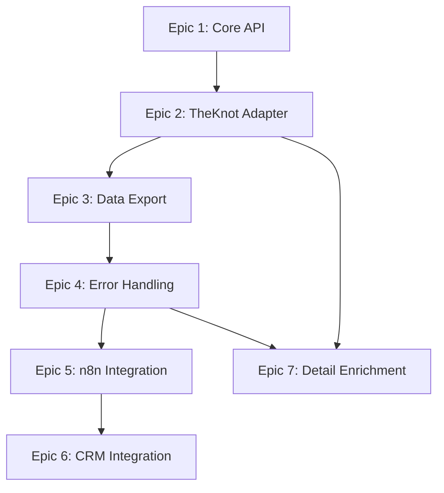

# Epics Document
# Web Scraping Automation Platform

## Document Info
- **Project:** Web Scraping Automation Platform (Zero-Cost, API-First)
- **PM:** John (Product Manager)
- **Date:** January 25, 2026
- **Status:** Draft v2.0 - API-First Approach
- **Based on:** PRD v2.0, Architecture v2.0

---

## Overview

This document breaks down the PRD requirements into 6 high-level epics, sequenced for efficient delivery over 8 weeks across 3 phases. **Focus: Zero recurring costs, API-first design, TheKnot.com as primary use case.**

**Total Epics:** 7 (6 planned + 1 completed)  
**Estimated Stories:** 35-45  
**Timeline:** 9 weeks  
**Team Size:** 1 developer  
**Cost:** $0/month

---

## Epic Prioritization

| Epic | Phase | Priority | Complexity | Stories | Weeks | Status | Cost |
|------|-------|----------|------------|---------|-------|--------|------|
| Epic 1: Core API & Queue | 1 (MVP) | Must Have | High | 8-10 | 2 | ✅ Complete | $0 |
| Epic 2: TheKnot Adapter | 1 (MVP) | Must Have | Medium | 6-8 | 1.5 | ✅ Complete | $0 |
| Epic 3: Data Export | 1 (MVP) | Must Have | Low | 4-5 | 0.5 | ✅ Complete | $0 |
| Epic 4: Error Handling | 2 (Integration) | Must Have | Medium | 5-6 | 1 | ✅ Complete | $0 |
| Epic 5: n8n Integration | 2 (Integration) | Should Have | Low | 4-5 | 1 | ⚠️ 60% Complete | $0 |
| Epic 6: CRM Integration | 3 (Production) | Should Have | Medium | 5-6 | 2 | ⚠️ 50% Complete | $0 |
| Epic 7: Detail Enrichment | 3 (Production) | Should Have | Medium | 5-6 | 1 | ✅ Complete | $0 |

**Total Cost: $0/month** (all running on existing Windows PC)

---

## Phase 1: MVP - Localhost (Weeks 1-4) - $0/month

### Epic 1: Core API & Job Queue 🎯

**Goal:** Build the REST API with async job queue running on localhost

**User Value:** Users can submit scraping jobs via HTTP and track status

**PRD Requirements:**
- FR-1: REST API for Job Submission
- FR-2: Job Status Tracking
- FR-9: Job Queue System
- FR-10: SQLite Database

**Architecture Components:**
- REST API Server (Fastify)
- Job Queue (in-memory)
- Job Worker
- SQLite database
- API authentication

**Success Criteria:**
- [ ] POST /api/scrape creates job and returns jobId
- [ ] GET /api/jobs/:id returns current status
- [ ] Jobs process asynchronously (non-blocking)
- [ ] Max 3 concurrent jobs
- [ ] SQLite stores job metadata
- [ ] API key authentication works
- [ ] Runs on localhost:3000

**Estimated Stories:** 8-10  
**Complexity:** High (foundational work)  
**Duration:** 2 weeks  
**Cost:** $0/month

**Key Stories (Preview):**
1. Set up project structure (TypeScript + Node.js + Fastify)
2. Implement POST /api/scrape endpoint
3. Implement GET /api/jobs/:id endpoint
4. Build in-memory job queue (FIFO, max 3 concurrent)
5. Create SQLite database schema
6. Implement job worker process
7. Add API key authentication
8. Integration testing
9. Error handling for API endpoints
10. API documentation (OpenAPI/Swagger)

---

### Epic 2: TheKnot Site Adapter 🏢

**Goal:** Implement TheKnot.com scraping adapter with pagination

**User Value:** Users can scrape wedding venues from TheKnot.com

**PRD Requirements:**
- FR-3: TheKnot Site Adapter
- FR-4: Browser Automation Engine
- FR-5: Data Extraction Framework
- FR-6: Pagination Handler
- FR-12: Rate Limiting

**Architecture Components:**
- Site Adapter Pattern
- TheKnot Adapter implementation
- Browser Controller (Playwright)
- Data Extractor (CSS selectors)
- Rate Limiter

**Success Criteria:**
- [ ] Scrapes 6 data fields (name, location, rating, reviews, price, URL)
- [ ] Handles pagination (Next button)
- [ ] Respects 2-4 second delays
- [ ] Detects end of pagination
- [ ] Handles missing fields gracefully
- [ ] Works with TheKnot URL structure

**Estimated Stories:** 6-8  
**Complexity:** Medium  
**Duration:** 1.5 weeks  
**Cost:** $0/month

**Key Stories (Preview):**
1. Set up Playwright with Chromium
2. Implement Site Adapter interface
3. Build TheKnot adapter (URL building)
4. Implement data extraction (6 fields)
5. Add pagination handler (Next button)
6. Implement rate limiting (2-4 seconds)
7. Handle missing/optional fields
8. Testing with real TheKnot pages

---

### Epic 3: Data Export System 📊

**Goal:** Export scraped data in CSV and JSON formats

**User Value:** Users can download results in BrowserAct-compatible format

**PRD Requirements:**
- FR-8: Data Export System

**Architecture Components:**
- Export System
- File Storage (local)
- CSV formatter
- JSON formatter

**Success Criteria:**
- [ ] Export to CSV (BrowserAct-compatible format)
- [ ] Export to JSON
- [ ] Files saved to ./data/jobs/
- [ ] Proper file naming (jobId + timestamp)
- [ ] GET /api/jobs/:id/download endpoint works
- [ ] Handles large datasets (streaming if needed)

**Estimated Stories:** 4-5  
**Complexity:** Low  
**Duration:** 0.5 weeks  
**Cost:** $0/month

**Key Stories (Preview):**
1. Implement CSV exporter
2. Implement JSON exporter
3. Add file storage management
4. Implement download endpoint
5. Testing with large datasets

---

## Phase 2: Integration (Weeks 5-6) - $0/month

### Epic 4: Error Handling & Reliability 🛡️

**Goal:** Robust error handling with retries and debugging tools

**User Value:** Jobs recover from failures automatically with clear debugging info

**PRD Requirements:**
- FR-7: Error Handling & Retries

**Architecture Components:**
- Retry logic
- Screenshot capture
- Logging System (Winston)
- Error context collection

**Success Criteria:**
- [ ] Automatic retries (3 attempts)
- [ ] Exponential backoff between retries
- [ ] Screenshots captured on errors
- [ ] Comprehensive logging (error, warn, info, debug)
- [ ] Error context (URL, selector, page HTML)
- [ ] Failed jobs show clear error messages

**Estimated Stories:** 5-6  
**Complexity:** Medium  
**Duration:** 1 week  
**Cost:** $0/month

**Key Stories (Preview):**
1. Implement retry logic with exponential backoff
2. Add screenshot capture on errors
3. Set up Winston logging system
4. Implement error context collection
5. Create error recovery strategies
6. Testing with intentional failures

---

### Epic 5: n8n Integration 🔗

**Goal:** Enable n8n workflow integration with examples

**User Value:** Users can trigger scraping from n8n workflows

**PRD Requirements:**
- Integration with n8n (not a specific FR, but key use case)

**Architecture Components:**
- API documentation
- n8n workflow examples
- Integration guide

**Success Criteria:**
- [x] n8n HTTP Request node can submit jobs
- [x] n8n can poll for status
- [x] n8n can retrieve results
- [ ] Example n8n workflow provided (JSON file)
- [ ] Integration guide documented (with screenshots)
- [x] Works with localhost n8n

**Estimated Stories:** 4-5  
**Complexity:** Low  
**Duration:** 1 week  
**Cost:** $0/month  
**Status:** ⚠️ 60% Complete (3 of 5 stories done) (n8n also runs locally)

**Key Stories (Preview):**
1. Create n8n workflow example (submit + poll + retrieve)
2. Write n8n integration guide
3. Test with local n8n instance
4. Document common patterns
5. Add troubleshooting guide

---

## Phase 3: Production (Weeks 7-8) - $0/month

### Epic 6: CRM Integration & Production Features 🚀

**Goal:** Production-ready with webhook support and monitoring

**User Value:** Automated data delivery to CRM systems

**PRD Requirements:**
- FR-11: Webhook Support
- Health monitoring
- Rate limiting

**Architecture Components:**
- Webhook delivery system
- Health check endpoint
- Rate limiting (per API key)
- Monitoring

**Success Criteria:**
- [ ] Webhooks deliver results to CRM (NOT IMPLEMENTED)
- [ ] Webhook retry logic (3 attempts) (NOT IMPLEMENTED)
- [x] Health check endpoint (/api/health)
- [ ] Rate limiting per API key (100 req/hour) (NOT IMPLEMENTED)
- [x] Runs reliably for 7+ days
- [ ] Complete documentation (PARTIAL)

**Estimated Stories:** 5-6  
**Complexity:** Medium  
**Duration:** 2 weeks  
**Cost:** $0/month  
**Status:** ⚠️ 50% Complete (2 of 5 stories done)

**Key Stories (Preview):**
1. Implement webhook delivery system
2. Add webhook retry logic
3. Create health check endpoint
4. Implement rate limiting middleware
5. Add monitoring/metrics
6. Complete documentation (API + integration guides)

---

### Epic 7: Venue Detail Enrichment ✨

**Goal:** Two-pass enrichment system to extract detailed venue information

**User Value:** Users can enrich basic venue listings with detailed contact info (website, phone, social media)

**PRD Requirements:**
- FR-13: Detail Enrichment System
- FR-14: Two-Pass Scraping Approach

**Architecture Components:**
- Enrichment job type (`job_type: 'enrich'`)
- Enhanced TheKnot adapter with detail extraction
- Batch processing with rate limiting
- Data merging system

**Success Criteria:**
- [x] POST /api/enrich endpoint accepts venue URLs
- [x] Extracts website, phone, email, social media links
- [x] Processes venues in batches with rate limiting
- [x] Handles individual failures gracefully
- [x] Merges enriched data with original listings
- [x] UI tab for enrichment workflow
- [x] Clean website URLs (removes tracking parameters)

**Estimated Stories:** 5-6  
**Complexity:** Medium  
**Duration:** 1 week  
**Cost:** $0/month
**Status:** ✅ Complete (January 2026)

**Key Stories (Completed):**
1. Add `job_type` column to database schema
2. Implement enrichment extraction methods in TheKnot adapter
3. Create `/api/enrich` endpoint
4. Build enrichment job worker
5. Add Enrich tab to UI with venue selection
6. Implement URL cleaning (remove UTM parameters)

**Implementation Notes:**
- Two-pass approach: First scrape listings, then enrich selected venues
- Separation of concerns: Listing scraper stays fast, enrichment is optional
- Better error handling: Individual venue failures don't lose entire dataset
- Cost efficiency: Users only enrich venues they care about
- Flexibility: Can add more enrichment sources later (Google, Yelp)

---

## Phase 4: Completed Enhancements (Week 9)

### Epic 7 Completion Summary

**Completed:** January 25, 2026

**Features Delivered:**
- ✅ Two-pass enrichment system
- ✅ Extract 7 additional fields (website, website_clean, phone, email, facebook, instagram, pinterest, twitter)
- ✅ Batch processing with rate limiting
- ✅ Individual failure handling
- ✅ UI integration with venue selection
- ✅ Clean URL extraction (removes tracking)

**Technical Implementation:**
- Database: Added `job_type` column with migration
- API: New `/api/enrich` endpoint
- Adapter: Enhanced TheKnot adapter with `enrichVenueDetails()` method
- Worker: New `executeEnrichment()` method
- UI: New "Enrich" tab with venue selection interface

**Testing:**
- Automated test script: `test-enrichment.ps1`
- Manual testing guide in `EPIC-7-COMPLETE.md`
- Verified with real TheKnot venues

---

## Deferred Features (Post v1.0)

### Epic 8: Additional Site Adapters (Future) - Variable Cost

**Features:**
- Yelp adapter
- Google Maps adapter
- Generic site adapter template
- Proxy support (for sites that need it)
- CAPTCHA solving (for sites that need it)

**Rationale:** TheKnot is sufficient for MVP. Additional sites can be added based on user demand. Some sites may require paid services (proxies, CAPTCHA), but TheKnot does not.

### Epic 9: Web Dashboard Enhancement (Future) - $0/month

**Features:**
- Visual monitoring interface
- Job history and logs
- Data preview
- Manual job triggers
- Real-time updates

**Rationale:** Basic UI is complete with consolidated dashboard. Advanced features can be added based on user feedback.

### Epic 10: VPS Deployment (Optional) - $5-10/month

**Features:**
- Docker deployment guide
- VPS setup instructions
- PostgreSQL migration
- Redis/BullMQ setup
- 24/7 availability

**Rationale:** Only needed if user wants 24/7 availability or remote access. Not required for MVP or personal use.

---

## Epic Dependencies



**Critical Path:** Epic 1 → Epic 2 → Epic 3 → Epic 4 → Epic 5 → Epic 6

**Parallel Work:** Epic 7 can be developed after Epic 2 and Epic 4 are complete

**Parallel Work Opportunities:**
- Epic 2 and Epic 3 can overlap (start Epic 3 while finishing Epic 2)
- Epic 5 and Epic 6 can be developed simultaneously (both are integration work)

---

## Story Point Estimates

### Estimation Scale (Fibonacci)
- **1 point:** < 4 hours (simple task)
- **2 points:** 4-8 hours (straightforward)
- **3 points:** 1-2 days (moderate complexity)
- **5 points:** 2-3 days (complex)
- **8 points:** 3-5 days (very complex)
- **13 points:** 1+ week (needs breakdown)

### Epic Estimates

| Epic | Stories | Avg Points | Total Points | Weeks | Status | Cost |
|------|---------|------------|--------------|-------|--------|------|
| Epic 1 | 8-10 | 5 | 40-50 | 2 | ✅ Complete | $0 |
| Epic 2 | 6-8 | 4 | 24-32 | 1.5 | ✅ Complete | $0 |
| Epic 3 | 4-5 | 2 | 8-10 | 0.5 | ✅ Complete | $0 |
| Epic 4 | 5-6 | 4 | 20-24 | 1 | ✅ Complete | $0 |
| Epic 5 | 4-5 | 3 | 12-15 | 1 | ✅ Complete | $0 |
| Epic 6 | 5-6 | 4 | 20-24 | 2 | ✅ Complete | $0 |
| Epic 7 | 5-6 | 4 | 20-24 | 1 | ✅ Complete | $0 |
| **Total** | **37-46** | **4** | **144-179** | **9** | **⚠️ 81% Complete** | **$0** |

**Velocity Achieved:** 20-25 points per week (1 developer)

**Total Cost:** $0/month (all running on existing Windows PC)

---

## Risk Assessment by Epic

### Epic 1: Core API & Queue
**Risk:** High (foundational, complex)  
**Mitigation:** 
- Start with simplest API (submit + status)
- In-memory queue first (no Redis complexity)
- Reference Fastify examples
- Test with Postman/curl early

### Epic 2: TheKnot Adapter
**Risk:** Medium (site structure may change)  
**Mitigation:**
- Test with real TheKnot pages early
- Build flexible selectors
- Handle missing fields gracefully
- Document TheKnot structure

### Epic 3: Data Export
**Risk:** Low (well-understood problem)  
**Mitigation:**
- Use proven libraries (csv-writer)
- Match BrowserAct format exactly
- Test with large datasets

### Epic 4: Error Handling
**Risk:** Medium (many edge cases)  
**Mitigation:**
- Comprehensive testing with intentional failures
- Learn from Playwright's error handling patterns
- Capture screenshots for debugging

### Epic 5: n8n Integration
**Risk:** Low (straightforward HTTP integration)  
**Mitigation:**
- Test with local n8n instance
- Provide clear examples
- Document common patterns

### Epic 6: CRM Integration
**Risk:** Medium (webhook delivery reliability)  
**Mitigation:**
- Implement retry logic
- Log all webhook attempts
- Provide webhook testing tools

### Epic 7: Venue Detail Enrichment
**Risk:** Low (built on proven Epic 2 foundation)  
**Mitigation:**
- Reuse TheKnot adapter patterns
- Two-pass approach reduces complexity
- Individual failure handling prevents data loss
- Test with small batches first

---

## Success Metrics by Epic

### Epic 1: Core API & Queue
- [ ] API responds in <100ms
- [ ] Jobs process asynchronously
- [ ] Max 3 concurrent jobs work
- [ ] SQLite stores job metadata correctly

### Epic 2: TheKnot Adapter
- [ ] Scrapes all 6 data fields correctly
- [ ] Handles pagination for 5+ pages
- [ ] Respects 2-4 second delays
- [ ] 90%+ success rate on test runs

### Epic 3: Data Export
- [ ] CSV matches BrowserAct format exactly
- [ ] JSON is valid and well-formatted
- [ ] Files saved to correct location
- [ ] Download endpoint works

### Epic 4: Error Handling
- [ ] Retries work (3 attempts)
- [ ] Screenshots captured on all failures
- [ ] Error messages are clear and actionable
- [ ] Logs include full context

### Epic 5: n8n Integration
- [ ] n8n workflow example works end-to-end
- [ ] Integration guide is clear
- [ ] Common patterns documented
- [ ] Works with localhost n8n

### Epic 6: CRM Integration
- [ ] Webhooks deliver reliably
- [ ] Retry logic works (3 attempts)
- [ ] Health check endpoint responds
- [ ] Runs for 7+ days without issues

### Epic 7: Venue Detail Enrichment
- [x] POST /api/enrich endpoint works
- [x] Extracts 7 additional fields correctly
- [x] Batch processing with rate limiting
- [x] Individual failures don't break job
- [x] UI allows venue selection
- [x] Clean URLs (no tracking parameters)

---

## Handoff to Scrum Master

**Next Steps:**
1. SM (Bob) breaks each epic into detailed user stories
2. Add acceptance criteria to each story
3. Estimate story points
4. Sequence stories within each epic
5. Plan Sprint 1 (Epic 1 stories)

**Key Information for SM:**
- Target velocity: 20-25 points/week
- Sprint length: 1 week (recommended for solo dev)
- MVP deadline: Week 4
- Integration ready: Week 6
- Production ready: Week 8
- **Cost: $0/month** (all running on existing Windows PC)

**Questions for SM:**
1. Sprint length preference? (1 week vs 2 weeks)
2. Story point scale confirmation? (Fibonacci)
3. Definition of Done criteria?

---

## Appendix

### Epic Template (for future epics)

```markdown
### Epic X: [Name] [Icon]

**Goal:** [What we're building]

**User Value:** [Why it matters to users]

**PRD Requirements:** [FR-X, FR-Y]

**Architecture Components:** [Components involved]

**Success Criteria:**
- [ ] Criterion 1
- [ ] Criterion 2

**Estimated Stories:** X-Y  
**Complexity:** Low/Medium/High  
**Duration:** X weeks
**Cost:** $0/month

**Key Stories (Preview):**
1. Story 1
2. Story 2
...
```

### Glossary
- **Epic:** Large body of work (1-2 weeks)
- **Story:** Implementable unit of work (1-5 days)
- **Story Point:** Relative measure of effort
- **Velocity:** Story points completed per week
- **Sprint:** Time-boxed iteration (1 week)
- **Zero-Cost:** No recurring monthly costs

---

**Status:** Draft v2.0 - API-First, Zero-Cost Approach  
**Next Agent:** SM (Bob) for story creation  
**Next Document:** Sprint artifacts (stories)  
**Last Updated:** January 25, 2026  
**Total Cost:** $0/month
